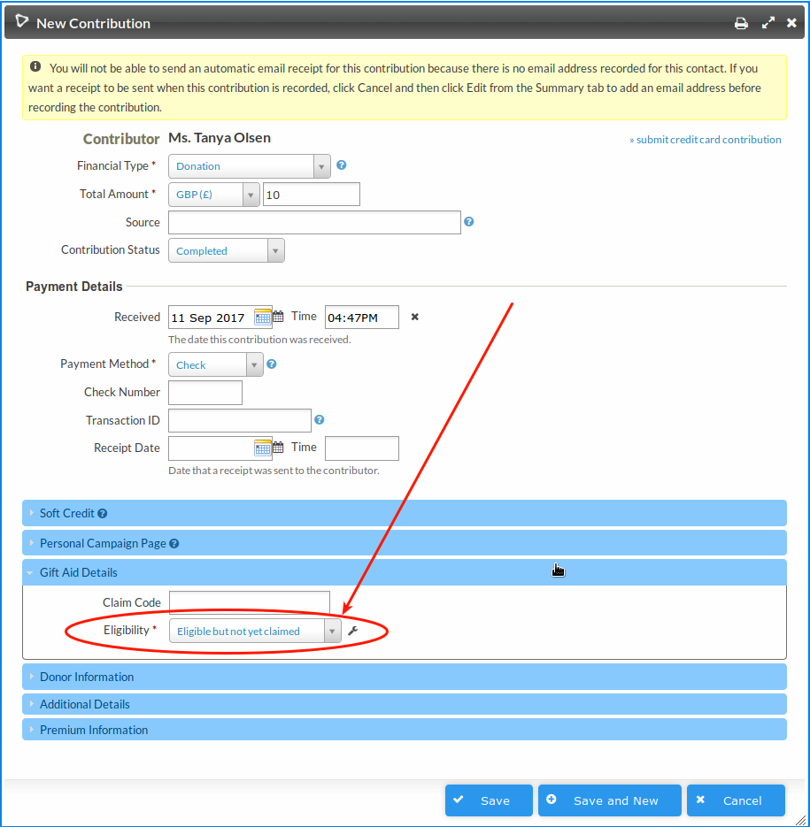
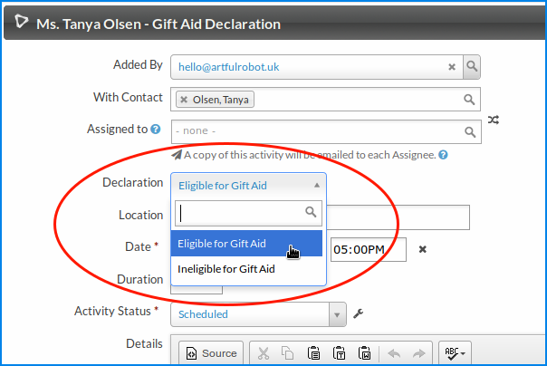
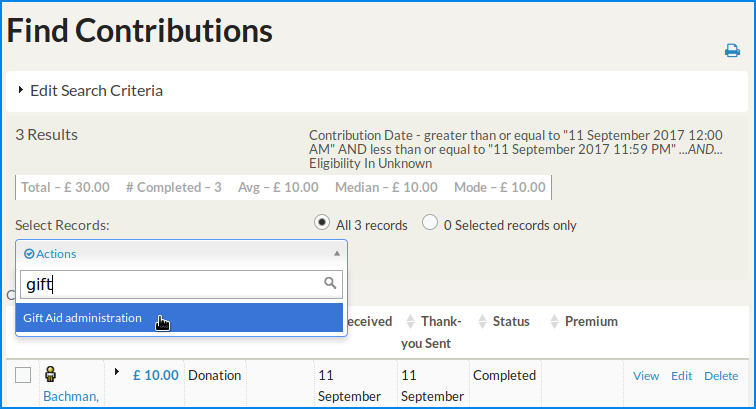
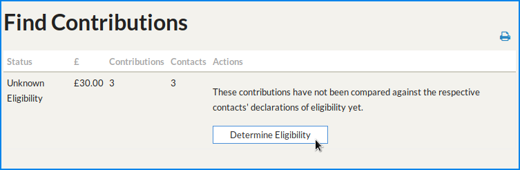
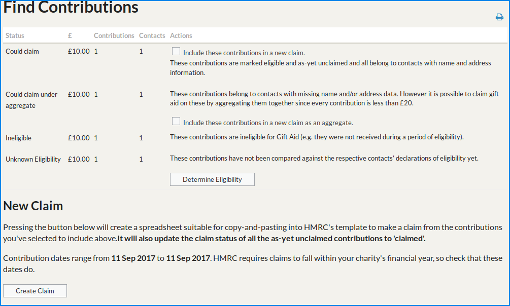
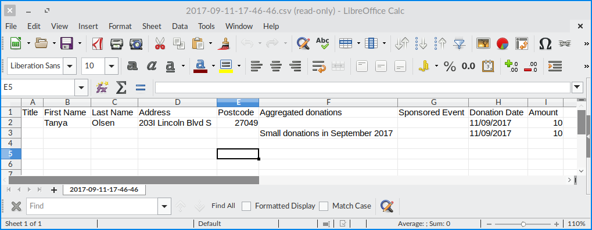

# Usage

## Check you know your stuff. (and a disclaimer!)

You need to be up-to-date on what you can and cannot claim Gift Aid on. There
may be a time when things change and this extension is no fit for use (please
submit an
[Issue](https://github.com/artfulrobot/uk.artfulrobot.civicrm.giftaid/issues) if
so!) and you need to know this rather than rely on the tool!

Typically you need to record a declaration and a payment needs to have been for
the purposes of donating to your registered charity. Some donations may come
through that you know are not eligible (e.g. someone has collected money from
elsewhere and gives it to you as a one off donation using your online donation
form); it's up to you to ensure Gift Aid is not claimed on this.

## Typical workflow

1. Collect donations and declarations.
2. Do a claim for a batch of donations.

## Record Donations

You collect donations and they are entered as Contributions in CiviCRM. This may
be an online process, manual data entry, a contributions import or an API-driven
integration -- anything is valid.

Note that there's a new Gift Aid fieldset on contributions with a drop-down containing:

- Unknown
- NOT eligible for Gift Aid
- Eligible but not yet claimed
- Eligible and has been claimed

As seen here:

This defaults to **Unknown**, and that's fine for now - keep reading.

## Record Declarations

You also collect Gift Aid declarations from people. People may tell you "this
one donation is eligible" or they may tell you "treat all of my donations from
now on as eligible". They may also tell you "My donations are not/no longer
eligible for Gift Aid".

You can store Gift Aid Declarations (either positive or negative) using the Gift
Aid Declaration activity. The date of the activity serves as the date the
declaration is valid from, so you could back-date it. If you do back date it,
it's probably a good idea to record what you did in the Details section so that
someone looking at the record in future understands what you did.

Note that for third party integrations there's a helper method to record a
declaration activity.

## Identify eligibility of the 'unknowns' based on the declaration.

So far, unless we manually set the eligibility status, our donations are all of
'unknown' eligibility. Now it's time to make a claim and we need to know which
ones are and which ones are not eligible of these unknowns.

Do a Contributions Search to find the unknowns. You'll want to filter for
Eligibility: Unknown, but also it's up to you to select only charitable
donations as CiviCRM Contributions can also include payments for goods and
services. Of course the contributions search can also pick up contributions from
Organisations, or non UK residents, too. So you need to know your organisation's
data well.

On the search results page select all the contributions and choose Gift Aid
administration:

You should then see something like this:

Hit that button and you should be bounced back to a Find Contributions page with
a message that the contributions have been updated:

- Contributions belonging to a contact who had an "I am eligible" declaration
  before the donation will have been set to "Eligible, not yet claimed".

- Contributions whose contact had an explicit "I am NOT eligible" declaration
  before the donation will have been set to "NOT eligible".

- Contributions whose contact does not have any declarations will have been left
  as "Unknown"

## Make a claim

Do another Contributions search for charitable donations. You can also filter
for "Eligible, not yet claimed" contributions. For the sake of helping
understand how this extension works, here's what it looks like if you forget to
filter on eligible contributions:

From this screen you can get key stats on your next claim:

- "Could Claim". This is (hopefully!) the bulk of your claim. You'll want to
  tick that box to include these in your claim.

- "Could claim under aggregate". These contributions belong to contacts with
  missing name and/or address data. However it is possible to claim gift aid on
  these by aggregating them together since every contribution is less than £20.
  If you're happy that this is legit' you can check that checkbox to include
  these aggregated contributions too.

- "Unclaimable". These contributions belong to contacts with missing name
  and/or address data and because they are greater than £20, they cannot be
  claimed as part of an aggregate line. So these will remain unclaimable until
  you find the person's details. You can create a group of these contacts
  if you want to look into them.

At the bottom you'll see a **Create Claim** button. Click that will produce a
spreadsheet that you can copy and paste into the Inland Revenue's claim
template spreadsheet. **You MUST save that spreadsheet for your records**.

Example:

At the same time as generating that spreadsheet, it marks the contributions as
claimed. It uses a timestamp as a "claim code" - this is just a way to get hold
of all the contributions in a certain claim at a later date, should you need to.

## Good to know

When determining eligibility the extension makes a timeline of all declarations
leading up to the date the contribution was made; only the last one of these is
valid for that particular contribution. So it's clever enough to pick
contributions that fall within a window of eligibility.

The make a claim process will refuse to work on any contributions that are not
marked "Eligible, not yet claimed". So if you click it having searched for
"Not eligible" contributions, you'll get an empty spreadsheet and no data will
have been changed.

Declarations given at any time on one day are assumed to apply to the whole of
that day. This extension used to do a per-second comparison, but this led to
problems.

The only data that is changed by the "Gift Aid Administration" process is the
two Gift Aid fields (claim code and eligibility) on those contributions. So if
you make a mistake you can reset them, either manually or by using a profile to
update the contributions, or such.
